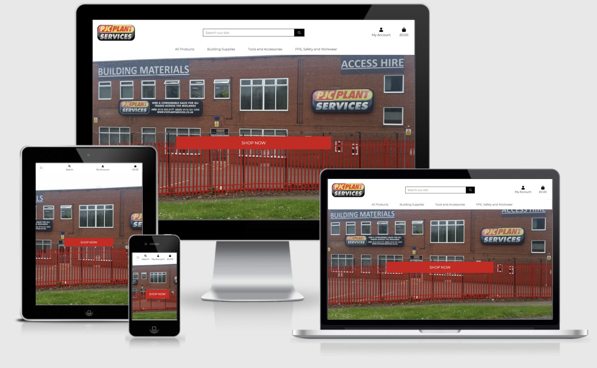

PJC Plant Services - E-Commerce Site - MS4
---
## Table of Contents

- [**About**](#About)
- [**UX**](#UX)
  - [Goals](#Goals)
  - [User Stories](#User-Stories)
  - [Styling](#Styling)
  - [Wireframes](#Wireframes)
- [**Features**](#Features)
  - [Existing Features](#Existing-Features)
  - [Features Left To Implement](#Features-Left-To-Implement)
- [**Technologies Used**](#Technologies-Used)
  - [Version Control](#Version-Control)
- [**Testing**](#Testing)
  - [Testing User Stories](#Testing-User-Stories)
  - [Responsive Testing](#Responsive-Testing)
  - [Additional Testing](#Additional-Testing)
  - [Code Validation](#Code-Validation)
- [**Deployment**](#Deployment)
  - [Live Website Link](#Live-App-Link)
  - [Repository Link](#Repository-Link)
  - [Running Code Locally](#Running-Code-Locally)
- [**Credits**](#Credits)
  - [Content](#Content)
  - [Media](#Media)
  - [Acknowledgements](#Acknowledgements)
  
---

## About

PJC Plant Services are a Hire and Consumables supplier to the construction Industry based in Leicester.

During Lockdown a lot of business was lost due to construction sites being closed. The mission for the business was to advertise and sell via a e-commerce store online to increase revenues and the customer base of the business as well as how they current supply via orders from the telephone and people visiting the store.

The online store needed the mirror the  products in the store and be easy for customers to find and buy the products they needed.

The online store also needed to be designed with the PJC Plant Services colour scheme and logo.

___

## UX

#### Goals

The goals of the website were:-
- Sell all products on the website that are currently sold from the warehouse.
- Hold secure information for all current customers and new customers so they can login to place orders.
- The website theme and colours must tie in with the company logo and profile
- The website must be accessible and show correctly on all devices from PC/Laptops to Tablets and mobile phones.
- Products on the website must be easily be able to be modified and added.
- Payments via the website must be secure.

---

#### User Stories

From the Designers Perspective:-
- The site must be easy to use and navigate and easy to find products.
- The site must show correct and east to view on all devices.
- The sites colour scheme must work with the PJC Plant Services logo colour scheme and font
- The Menus must be clear and concise so users can navigate around the site easily.
- Products must be able to be easily modified and added to the database
- Images for each product must be clear on all devices to the user.
- The shopping Bag must be clear of what products are being brought and how much the total cost is including delivery.
- Login and Registration to the site must be secure but easy for the user to do.
- Details about the company location and other social media formats must be shown.
- Products can be searched easily and also ordered easily by Price, Rasting etc.
- The checkout page must be secure and easy to understand so the user can complete the purchase easily and quickly.

From the users perspective:-
- I need to find the product I want to buy easily.
- My personal details held on the site need to be secure and access needs to be secure.
- I need to be able to see the product clearly before purchasing.
- I need to be able to see how much my total order is going to cost including delivery.
- I need to be able to modify products and add products to the database.
- I need to be able to place the order easily and securely through the website.
- I need to be able to register for a new account easily so I can buy products.
- I need the system to store my details so I dont have to fill this out everytime I place a order.

---

### Styling

The site must be easy to view on all devices with menus clear and concise, the colours must integrate with the colour scheme of the PJC Plant Services Logo.

The below colour scheme was used for the menus and text.

The font chosed was Montserrat because it was clear and concise. The backup font if google fonts didnt load is Sans-Serif.

The background image used for the site was a picture of the head office to shot customers when entering the site they was dealing with a reputable and professional company for all construction supply needs..

---

### Wireframes

Wireframes/Database Tables Link - [Wireframes](Documentation/Wireframes/Wireframes.pdf)

**Design Changes to Wireframes**
- Colour changes added to menu when hovering with a mouse
- Menu Structure was changed and shortened for a better user experience.
- Has sizes taken out on the products, individual products for each size will be added to the site instead.

---

## Features

### Existing Features

- The navigation menu shows at the top but shrinks to a burger on smaller devices and shows on the left side of the screen with a company logo shrinking to give the user access back to the homepage.
- Users can login and register to the system which will be stored on the system for delivery information to be automatically stored for future orders.
- Admin access must be given by the system administrator with access to Django Admin.
- Different menu options show between admin and standard user, admin users can add and modify products and have access to the product management pages.
- Standard users have access to only buy products and update there profile information.
- Purchases at the checkout are made via Stripe for secure purchases via card.
- Users details of the shopping cart are stored until the browser is closed.
- The footer is pinned to the bottom of all pages.
- Webhooks are generated when a purchase is made in case any issues wth the site craching or user error, the order and payments still go through to stripe and to the database via the webhook.
- The search function searches all products and matches the product name and description of anything added in the search critera.
- Boostrap classes are used on all pages so it shows on mobile devices as well as large devices, pictures used are clear and concise for each product the give the user the best experience.

### Features Left To Implement

- Product Quantities to be linked the the purchasing/stock system so stocks can be checked before placing orders.
- More products to be added to match the total catalogue for the company.

---

## Technologies Used

- Bootstrap
  - Bootstrap was used for page structures and features like the menu system.

- HTML  
  - HTML was used for the main structure of the website.

- JQuery/Javascript
  - JQuery was used for boostrap features that needed some javascript function - Return to top button.

- CSS
  - CSS was used to style and change sizes and positions of different items where boostrap couldn't be used.

- Python 
  - Python was used for creating the apps, models for each section.

- Django
  - Django was used for the framework for the website alongside Python.

- Google Chrome
  - Google Chrome Inspect and Developer tools was used for examining the website on different devices.

- Google Fonts
  - Google fonts was used for the font of the website.

- Font Awesome
  - Font Awesome was used for the icons on the forms.

- VS Code 
  - VS Code was used as the development tool to create all pages. Different add-ons were used in VS Code to aid my developement. These add-ons included were:-
    - Auto Close and Rename Tag - to end tags automatically.
    - Beauty - To help Beautify my coding.
    - Color Highlight - Shows the colours in your coding.
    - CSS Peek - Allows you to show the CSS Next to your HTML Code, rather than going between the two files.
    - Live Server - Allows you to see the live webpage as you code
    - Markdown Preview Enhancer - Allows you to see your markdown file as you type.
    - Prettier - Allows you to Beautify your CSS.

- Balsamiq was used to create the wireframes

### Version Control

- VS Code
  - VS Code linked to the repositry in Github was used to do regular Commits from my changes and additions to the website.

- Github
  - Github was used to store the repositry online. All Adds/Commits go to this file online. 

- Heroku
  - Heroku was used to store and run the application, heroku was linked to github to auto update.

- AWS
  - Amazon web services was used to store the static files for the site.

- Postrgres SQL
  - PostgresSQL was used to store the datafor orders, customers etc migrated from the SQL Lite in the development environment.

---

## Testing

### Testing User Stories

| Story  |  Test | Extra Coding Required  |
|---|---|---|
|I need to find the product I want to buy easily|Tested the different menus, search function to find products|All working ok|
|My personal details held on the site need to be secure and access needs to be secure|Tested the secure login to Django and the site and Heroku once deployed|All secure|
|I need to be able to see the product clearly before purchasing|Tested viewing the produucts on different devices|Some products showed too small on mobile devices so I made them bigger using a 12 Column instead of 2 6 Columns|
|I need to be able to see how much my total order is going to cost including delivery|Tested the order in the bag and at checkout and the bag total updating when more products are added|All working ok|
|I need to be able to modify products and add products to the database|Tested logging in as Admin and using the Product Management, Edit and Delete Functions|All worked ok|
|I need to be able to place the order easily and securely through the website.|Tested the bag and checkout pages, was an issue with the country field|Changed the country to a dropdown menu to avoid issues with stripe and countires, used django-countries to do this|
|I need to be able to register for a new account easily so I can buy products.|Tested regsitering an account and getting the email confirmation|The e-mail didnt initially work so i created a new gmail account and used gmail as the base to send emails to customers, once this worked, registration was easy|
|I need the system to store my details so I dont have to fill this out everytime I place a order.|When users checkout, made sure address details are auto populated if a customer has already registered|Added the option at checkout to save delivery details if they have changed, apart from that all working ok|

### Responsive Testing

To check how the site ran on different devices I used Am-I-Responsive and Inspect in Google Chrome Developer Tools. I also pushed out the site regular to the live area and accessed the link on my IPhone, Ipad and Macbook. While doing these tests I did the following:-

|  Test | Result  |  Extra Coding Required |
|---|---|---|
|Tested the home page on Mobile/Tablet and Large Screen devices|Was working ok apart from the shop now button was aligned to the right side on smaller devices|reduced the padding on the button on smaller devices|
|Tested the menu between large and small devices|When the mobile menu shrunk down, there wasn't any link to get back to the home page|Added the company logo as a link to get back to home on the mobile view|
|Tested the products menu when searching and adding to bag|product details and buttons wasn't showing correctly on smaller devices|reduced the size of buttons and text on smaller devices|
|Tested the Search/My Account/Bag on smaller devices|On smaller devices the links was going over to two rows|Made the links smaller on smaller devices so they stayed on one row|
|Tested the Sort by and catergories links on small devices|Shrunk down and shown correctly by stacking on top|N/A|
|Tested the footer on all devices|Links were too small originally but everything else worked and staked ok|Made links bigger and changed colour when hovered to give the user a better experience|
|Tested all menu links on all devices|All links worked but the user didn't know which link he was definitely hovering over|Changed the background colour to greay when the user hovered over menu links to give them a better user experience|

### Additional Testing

I also carried the following addtional testing:-
|  Test | Result  |  Extra Coding Required |
|Flake8 - Ran flake8 on all my python code|correct the main error like fields not being used|N/A|
|Tested move from SQLite to PostGresSQL|Checked the export file before moving accross to the database on Heroku|N/A|
|Ran tests on AWS when the static files were moved over|Base.css wasn't moved over correctly|Created in the relevant folder and the site showed correctly|

### Code Validation

- W3C Markup Validation Service for HTML.
- W3C CSS Validation Service was used for validating the code.
- http://pep8online.com/ - For Validation Python Code.
- Slack - Peer Code Review Forum.

 ---

## Deployment

### Live Website Link

https://pjc-plant-services-ms4.herokuapp.com/

### Repository Link

https://github.com/MattMoore050783/MS4-PJC-Plant-Services

### Running Code Locally

To deploy the project the following is required:-

- Github account
- Heroku Account
- AWS Account

To create a clone follow the below steps:- 

Github
1. Login to github and find the repository.
2. Click Code and open with Github Desktop.
3. Follow the prompts in the GitHub Desktop Application.

---

## Credits

### Code

I used the following links to help my coding:-
- Code Institue task project for basic setup and and linking to MongoDB
- https://www.tutorialspoint.com/materialize/index.htm - For Materialize tips
- https://werkzeug.palletsprojects.com/en/1.0.x/utils/ - for Werkzeug tips
- https://palletsprojects.com/p/jinja/ - for Jinja coding
- https://stackoverflow.com/ - for various issues when writing queries in Python.
- https://www.w3schools.com/python/default.asp - for extra help and tuition with Python.
- https://www.youtube.com/watch?v=dam0GPOAvVI - for extra help with python and flask to understand it better.

### Content

All content for the site was based on what would be required by Paul John employees if this app was to be live.

### Media

All pictures were taken from Paul John on our existing website which I also developed

### Acknowledgements

Many Thanks to the below for the help and guidances throughout my project:- 
- My Mentor Maranatha
- Code Institues support team for increasing my hand in date and being supportive while i was working my day to day job through the pandemic.
- The slack community for feedback on my website. 
- Code Institute and the learning programme Python and the task mini project.
